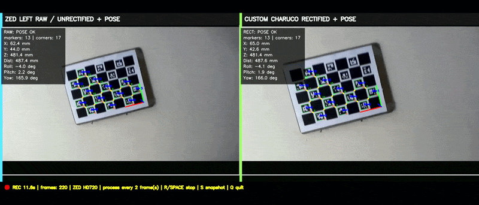
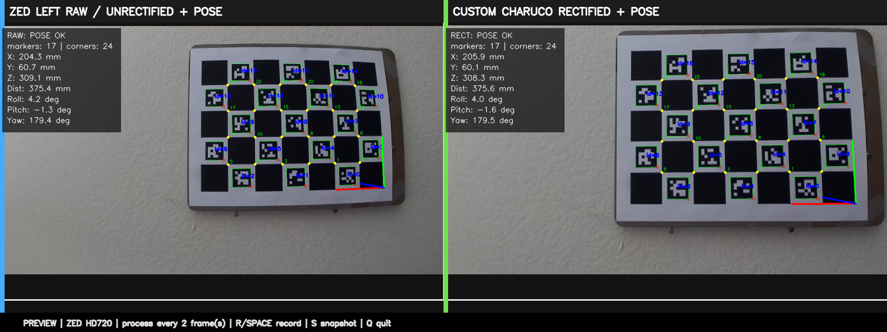

# Validated Stereo Camera Calibration and 6-DoF Fiducial Pose Estimation



A device-agnostic OpenCV toolkit for stereo camera calibration, rectification validation, and ChArUco-based 6-DoF pose-estimation demos.

This repository is intentionally **vendor-neutral**. It does not include vendor SDK code, private camera serial numbers, factory calibration files, or large raw captures. Users provide synchronized stereo image pairs from any stereo camera system.

## Why this project exists

Stereo calibration is not finished when `stereoCalibrate()` returns an RMS value. A production-style workflow should also verify target geometry, reject weak frames, compute rectification maps, validate epipolar alignment, and export reproducible reports.

This repo demonstrates that workflow:

1. Prepare synchronized left/right stereo image pairs.
2. Configure a checkerboard or ChArUco target.
3. Run dataset QC before calibration.
4. Calibrate stereo intrinsics/extrinsics.
5. Generate rectification maps.
6. Validate rectification with vertical epipolar error.
7. Generate raw-vs-rectified demo media.
8. Run fiducial-based 6-DoF pose estimation and log pose values.

## Features

- Checkerboard and ChArUco target support.
- Dataset QC with detection counts, sharpness, board area, and stereo pair status.
- Stereo calibration using OpenCV `calibrateCamera()` and `stereoCalibrate()`.
- Rectification-map generation with `stereoRectify()` and `initUndistortRectifyMap()`.
- Epipolar validation using vertical alignment error after rectification.
- Raw-vs-rectified visualization with horizontal guide lines.
- ChArUco 6-DoF pose estimation with annotated video and per-frame CSV logging.
- JSON/CSV outputs for engineering review.

## What is intentionally excluded

- Vendor SDK acquisition code.
- Device serial numbers.
- Private calibration files.
- SVO or other large raw captures.
- Factory calibration downloaded from a vendor.
- Local machine paths.

## Installation

```bash
python -m venv .venv
# Windows
.venv\Scripts\activate
# Linux/macOS
source .venv/bin/activate

python -m pip install --upgrade pip
python -m pip install -r requirements.txt
```

## Quick start

Place synchronized stereo pairs here:

```text
examples/sample_stereo_pairs/left/
examples/sample_stereo_pairs/right/
```

Use matching filenames or sorted order, for example:

```text
left/pair_000001.png
right/pair_000001.png
```

Run ChArUco QC:

```bash
python scripts/03_qc_charuco_dataset.py \
  --left examples/sample_stereo_pairs/left \
  --right examples/sample_stereo_pairs/right \
  --board configs/board_charuco.yaml \
  --output outputs/qc_charuco
```

Run stereo calibration:

```bash
python scripts/04_run_stereo_calibration.py \
  --target charuco \
  --left examples/sample_stereo_pairs/left \
  --right examples/sample_stereo_pairs/right \
  --board configs/board_charuco.yaml \
  --qc-csv outputs/qc_charuco/selected_pairs.csv \
  --output outputs/calibration_charuco
```

Validate rectification:

```bash
python scripts/05_validate_rectification.py \
  --target charuco \
  --left examples/sample_stereo_pairs/left \
  --right examples/sample_stereo_pairs/right \
  --board configs/board_charuco.yaml \
  --calibration outputs/calibration_charuco/stereo_calibration.npz \
  --output outputs/rectification_validation
```

Create a rectification demo:

```bash
python scripts/06_make_rectification_demo.py \
  --left examples/sample_stereo_pairs/left \
  --right examples/sample_stereo_pairs/right \
  --calibration outputs/calibration_charuco/stereo_calibration.npz \
  --output outputs/demo/rectification_demo.mp4
```

Run pose-estimation demo on a video or live camera:

```bash
python scripts/07_run_charuco_pose_demo.py \
  --source 0 \
  --board configs/board_charuco.yaml \
  --calibration outputs/calibration_charuco/stereo_calibration.npz \
  --output outputs/pose_demo
```

## Key outputs

- `stereo_calibration.npz`: camera matrices, distortion, stereo extrinsics, rectification maps, and `Q`.
- `calibration_summary.json`: RMS, baseline, pair count, image size.
- `rectification_summary.json`: mean/median/P95/max vertical epipolar error.
- `rectification_pair_errors.csv`: per-pair error statistics.
- `pose_log.csv`: per-frame ChArUco pose values.
- Demo MP4 or PNG visualizations.

## Example Output

### Real-Time ChArUco 6-DoF Pose Estimation



## Industrial use cases

- Robot workcell camera calibration.
- Camera-guided alignment and fiducial tracking.
- Stereo-depth preprocessing.
- 3D object localization.
- Multi-camera validation workflows.
- Visual odometry / SLAM preprocessing.
- Calibration station prototyping.

## Notice
  The codes and text are optimized by AI

## License

Apache-2.0.
